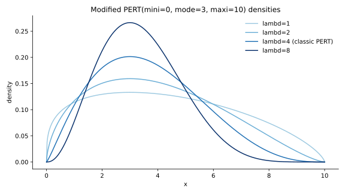

[](https://pypi.org/project/beta-pert-dist-scipy/)
[](https://github.com/hbmartin/betapert/actions/workflows/ci.yml)
[](https://github.com/astral-sh/ruff)
[](https://pypi.org/project/beta-pert-dist-scipy/)
[](LICENSE)

This package provides the [PERT](https://en.wikipedia.org/wiki/PERT_distribution) (also known as beta-PERT) distribution.

# Background
PERT stands for "[program evaluation and review technique](https://en.wikipedia.org/wiki/Program_evaluation_and_review_technique)", the original context for which the distribution was first proposed by [Clark (1962)](https://doi.org/10.1287/opre.10.3.405).

The PERT distribution is widely used in risk and uncertainty modelling to represent uncertain quantities where one is relying on subjective estimates. This is because the three parameters defining the distribution are intuitive to the estimator.

# This package
Both the PERT distribution and its generalization, the modified PERT distribution, are provided.

The distributions work exactly like SciPy continuous probability distributions. They are subclasses of `rv_continuous`.



# Installation
```shell
uv add beta-pert-dist-scipy
```

Requires Python 3.12+ and SciPy 1.14.1+. The package ships type information (`py.typed`).

# Usage

```python
from betapert import pert, mpert

# Define the distribution:
dist = pert(10, 30, 90)
# Or, using keyword arguments:
dist = pert(mini=10, mode=30, maxi=90)

# Call standard SciPy methods:
dist.pdf(50)
dist.cdf(50)
dist.mean()
dist.rvs(size=10)

# Or, you can directly use the methods on this object:
pert.pdf(50, mini=10, mode=30, maxi=90)
pert.cdf(50, mini=10, mode=30, maxi=90)
pert.mean(mini=10, mode=30, maxi=90)
pert.rvs(mini=10, mode=30, maxi=90, size=10)

# The modified PERT distribution is also available.
# A PERT distribution corresponds to `lambd=4`.
# Note that you cannot call `mpert` without specifying `lambd`
# (`pert` and `mpert` must have different signatures since SciPy does
# not support optional shape parameters).
mdist = mpert(10, 30, 90, lambd=2)

# Values of `lambd<4` have the effect of flattening the density curve
#       6%                 >  1.5%
assert (1 - mdist.cdf(80)) > (1 - dist.cdf(80))
```

## Features beyond basic SciPy plumbing

**Degenerate modes.** The mode may coincide with either bound — handy for "best case is that nothing goes wrong" estimates:

```python
dist = pert(0, 0, 10)  # mode at the minimum
```

**Fitting.** Estimate parameters from data by maximum likelihood (`lambd` is held fixed):

```python
import betapert

data = pert(10, 30, 90).rvs(size=10_000)
mini, mode, maxi = betapert.fit(data)           # classic PERT (lambd=4)
mini, mode, maxi = betapert.fit(data, lambd=2)  # modified PERT
```

**Vectorized parameters.** Parameters broadcast like any SciPy distribution:

```python
import numpy as np

pert.pdf(50, mini=np.array([10, 0]), mode=np.array([30, 40]), maxi=np.array([90, 100]))
```

**Fast closed forms.** `mean`, `var`, `skew`, `kurtosis`, `entropy`, and non-central moments of any order use closed-form expressions rather than numerical integration.

**Robust quantiles.** If SciPy's beta quantile function returns NaN for extreme probabilities, a log-space fallback solver is used automatically. Set `betapert.FALLBACK = None` to disable it.

## Formulas

The PERT distribution on `[mini, maxi]` with mode `mode` is the beta distribution with

```text
alpha = 1 + lambd * (mode - mini) / (maxi - mini)
beta  = 1 + lambd * (maxi - mode) / (maxi - mini)
```

scaled to the interval `[mini, maxi]`, where `lambd = 4` for the classic PERT. Its mean is
`mu = (mini + lambd * mode + maxi) / (lambd + 2)`; for `lambd = 4` the variance satisfies the
classic identity `var = (mu - mini) * (maxi - mu) / 7`.

# Tests

A thorough test suite is included, covering SciPy integration, closed-form moments against
numerical integration, values pinned from Wolfram Mathematica, and Hypothesis property-based
tests.

```
❯ pytest
=============== 359 passed ===============
```

# Development

This project uses [uv](https://docs.astral.sh/uv/):

```shell
uv sync           # install dependencies
uv run pytest     # run tests
uv run ruff format . && uv run ruff check .   # format and lint
uv run ty check betapert                      # type check
```

# Authors

- [betapert (original)](https://github.com/tadamcz/betapert) by [Tom Adamczewski](https://github.com/tadamcz)
- beta-pert-dist-scipy Python 3.13+ drop-in replacement with adjusted beta distribution variance and kurtosis by Harold Martin

# License

[MIT](LICENSE)
